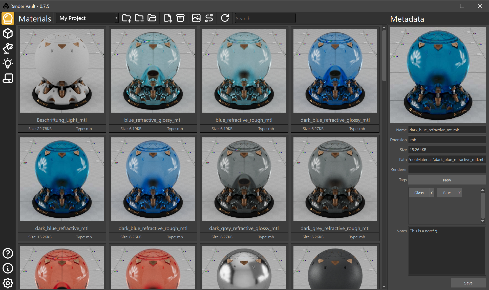

# Render Vault
## A Maya Asset Browser for Materials, Models, Lightsets, HDRIs and more.



### Description

Render Vault is A Maya Asset Browser for Materials, Models, Lightsets, HDRIs and more.

### Requirements

- Render Vault currently only supports Maya 2023 and 2024 on Windows and MacOS. Other Maya Versions and Operating Systems may work but are not tested. 
- Python 3.12 installed on the Machine that hosts the [Render Vault Server](https://github.com/Design0r/render_vault_server) (Can be your local PC or a Server connected to your Network)

### Installation

1. Clone the Render Vault repository or download the zip and extract it in your ../documents/maya/scripts directory 

2. Clone the [Render Vault Server](https://github.com/Design0r/render_vault_server) repository or download the zip and extract it in your ../documents/maya/scripts directory and follow the installation steps

3. Open the install.bat file in a Text Editor and change the mayapy_path to the mayapy.exe of your Maya installation
```shell
set mayapy_path="C:\Program Files\Autodesk\Maya2024\bin\mayapy.exe"
```
4. Run the install.bat file

5. Open Maya and run following Python snippet in the Maya Script Editor 
```shell
import render_vault
render_vault.main()
```

### Documentation
